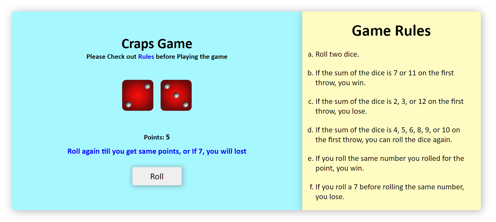

# Craps Game

This is a simple craps dice game create using HTML, CSS and JavaScript, which works on the following rules...

## Rules

- Roll two dice.
- If the sum of the dice is 7 or 11 on the first throw, you win.
- If the sum of the dice is 2, 3, or 12 on the first throw, you lose.
- If the sum of the dice is 4, 5, 6, 8, 9, or 10 on the first throw, you can roll the dice again.
- If you roll the same number you rolled for the point, you win.
- If you roll a 7 before rolling the same number, you lose.

# Craps Game final Interface screenshot

